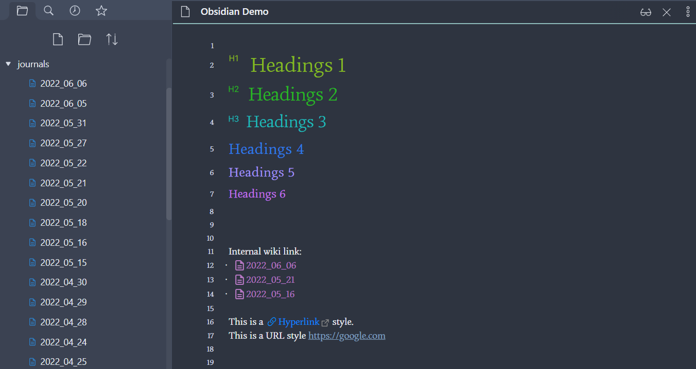

# Description

A snippet for Obsidian. [Download Snippet](release/bold-to-red.css)

Enhancement:

- Change file icon to `document`
- Optimized link style:
    - Add `document` icon for Obsidian internal wiki link
    - Add `hyperlink` icon for URL and markdown link
- Optimized headinds style:
    - Add `h1` `h2` `h3` icon for headings from h1 to h3

Demo based on `Obsidian Nord` theme:


# Development
## Install
```bash
npm i -g sass
```
## Run
- Windows: use PowerShell
- macOS: use Terminal

```bash
sass --watch src:release
```

## SVG Icons
[Bootstrap Icons · Official open source SVG icon library for Bootstrap](https://icons.getbootstrap.com/)

## Emoji
[Full Emoji List, v14.0](https://unicode.org/emoji/charts-14.0/full-emoji-list.html)


# Compile
```bash
sass src/bold-to-red.scss  bold-to-red.css
```